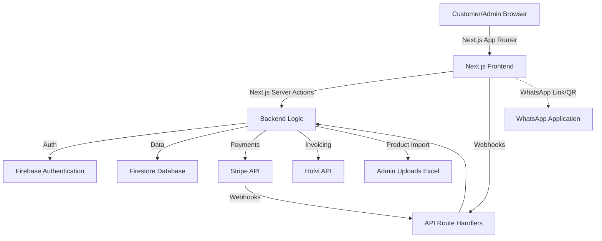

# Eqilo.fi Ecommerce Architecture Plan

## Background & Motivation
The Eqilo.fi webstore project aims to launch an online store focused on selling modern timekeeping devices from Swiss manufacturer FDS Timing, primarily targeting the Finnish market. The main customer groups include agility clubs and equestrian clubs, while also supporting other sports that require reliable timekeeping solutions. 

The webstore will introduce FDS Timing products, with particular emphasis on expanding adoption within agility sports, where the largest growth potential is expected. In addition to product sales, the webstore will promote Eqilo’s services, including competition consultation, technical support, equipment service, and training for timekeeping/results systems. The project highlights Eqilo’s strong expertise, built on over 20 years of experience working with competitions and timekeeping systems.

## Company Information
- **Company Name:** Eqilo Oy
- **Business ID:** 3530342-3
- **Postal Address:** Hakkapeliitantie 4, 08350 LOHJA
- **Phone:** +358 50 5633097

## Business Impact
The Eqilo.fi webstore will significantly improve accessibility to modern timekeeping solutions in Finland, lowering the barrier for clubs to adopt professional-level timing technology. Expected impacts include:
- Increased adoption of modern timekeeping technology in Finnish sports clubs.
- Growth in agility sport timing solutions (the primary expansion area).
- Improved event quality and professionalism across competition levels.
- Reduced setup complexity and technical challenges for event organizers.
- Strengthened Eqilo brand as a trusted expert in timing solutions.
- New business opportunities through consulting, training, and service offerings.
The webstore will serve as a foundation for long-term growth, expanding into additional sports and strengthening partnerships across Finland.

## Technical Scope
- **Customer Portal:** Product discovery, simple product search (utilizing native Firestore composite indexes and search limits, without external services), persistent carts saved to user accounts, mandatory account creation during the first order, Stripe checkout, and a dedicated **E-store Terms & Conditions** page which users must explicitly accept before completing a purchase.
- **Admin Panel:** Product management (importing from Excel, plus a fully-featured Product Manager/Editor to modify descriptions, prices, and status), order/inventory management, comprehensive Sales Dashboard, Cart management (ability to view, edit, override prices, and generate shareable public cart links), and a built-in CRM to manage customers and their orders.
- **Infrastructure & Deployment:** Hosted on Google Cloud Platform (GCP). The Next.js application will be containerized using a secure Docker image and deployed to **Google Cloud Run** for scalable, serverless execution. Firebase services (Firestore, Auth via email or phone number) will be used for the backend data layer.
- **Integrations:** Stripe (Payments), Holvi.fi (Invoicing), WhatsApp (Helpdesk), Google Analytics 4 / Plausible (Analytics).
- **Aesthetics:** Blue and white branding to match the Eqilo logo (`docs/eqilologo.jpeg`).
- **Internationalization (i18n):** Support for Finnish (FI - Default), English (EN), and Swedish (SE).
- **WhatsApp Helpdesk:** Integrated customer support via WhatsApp, configurable from the Admin Panel.
- **B2B Features & VAT Validation:** Support for a `b2b_customer` role, allowing business users to input a valid Finnish Business ID (Y-tunnus) for VAT handling and specialized invoicing.

## Proposed Solution

### Shipping & Pricing Rules
- **Shipping Costs:** A flat rate of **20 €** is applied to all orders below 200 €. Orders totaling **200 € or more** automatically qualify for **free shipping**. This logic will be enforced during the Stripe checkout session creation.
- **Localized Payments:** Through the Stripe Payment Element, the checkout will natively support **Apple Pay**, **Google Pay**, and **MobilePay** (highly preferred in Finland), alongside traditional credit cards and B2B invoice options.

### Architecture Diagram


### Data Model (Firestore)

**1. `customers` Collection**
- `id` (String) - Firebase UID
- `email` (String) - Optional if signed up via phone
- `phone_number` (String) - Optional if signed up via email; required by couriers
- `role` (String) - 'admin' | 'customer' | 'b2b_customer'
- `business_id` (String) - Y-tunnus, required for 'b2b_customer'
- `stripe_customer_id` (String)
- `shipping_address` (Object) - { line1, line2, city, postal_code, country }
- `billing_address` (Object) - { line1, line2, city, postal_code, country }
- `crm_notes` (String) - Admin-only internal notes for CRM

**2. `products` Collection**
- `id` (String)
- `name` (String)
- `description` (String)
- `price` (Number)
- `tax_rate` (Number) - e.g., 25.5 for Finnish general goods
- `sku` (String)
- `excel_ref_id` (String) - Original ID from Price List Excel
- `inventory_count` (Number)
- `is_active` (Boolean) - Allows drafting or hiding products
- `weight` (Number) - Essential for shipping calculation
- `dimensions` (Object) - { length, width, height }
- `image_urls` (Array of Strings)

**3. `orders` Collection**
- `id` (String)
- `user_id` (String)
- `items` (Array of Objects) - { product_id, quantity, price }
- `subtotal` (Number) - Pre-tax amount
- `tax_total` (Number) - Total VAT amount, required for Holvi invoicing
- `total_amount` (Number) - Final amount including tax
- `shipping_address` (Object) - Snapshot at the time of order
- `status` (String) - 'pending' | 'paid' | 'shipped'
- `tracking_number` (String)
- `courier` (String)
- `stripe_payment_intent` (String)
- `holvi_invoice_id` (String)
- `created_at` (Timestamp)

**4. `carts` Collection**
- `id` (String)
- `user_id` (String) - Optional (if assigned to a specific customer)
- `items` (Array of Objects) - { product_id, quantity, custom_price_override }
- `is_public_link` (Boolean) - Allows admins to share this cart via a public URL
- `abandoned_recovery_sent` (Boolean) - Tracks if an automated recovery message was sent
- `created_at` (Timestamp)
- `updated_at` (Timestamp)

**5. `settings` Collection**
- `id` (String) - Document ID (e.g., 'global')
- `whatsapp_helpdesk_number` (String) - Configurable international phone number for the WhatsApp helpdesk link.

### API Endpoints & Server Actions (Next.js App Router)
Following modern Next.js App Router best practices, data mutations and form submissions will be handled via **Server Actions** rather than traditional API Route Handlers. Route Handlers will be reserved exclusively for external webhooks.

- **Server Actions (Internal Mutations):**
  - `createCheckoutSession(cart)` - Initializes Stripe Checkout session securely on the server.
  - `generateInvoice(orderId)` - Communicates with Holvi.fi API to generate an invoice.
  - `importProducts(file)` - Parses uploaded `Price List 2026 V3.0.xlsx` and updates the product catalog in Firestore.
  - `updateSettings(data)` - Updates global site settings (e.g., WhatsApp helpdesk number).

- **Route Handlers (External Webhooks):**
  - `POST /api/webhooks/stripe` - Handles Stripe payment success, updates order status, securely triggers the Holvi invoice generation, and uses **Resend** to send a branded order confirmation to the customer and a notification email to the admin (`johannes@hyrsky.fi`).

### Consulting & Services (The Human Element)
To build trust and provide comprehensive solutions, the platform will feature dedicated, SEO-optimized content pages highlighting the store's human side. 
- **Store Owner & Expert:** Johannes Hyrsky. He provides personalized consulting, product installation, and technical support.
- **Service Pages:** The site will include specific landing pages detailing these service offerings, built using information provided in external documents:
  - **Training and Results Service:** Detailing operations managed in the field (reference: `Results service.pdf`).
  - **Equipe Results Software:** Presenting solutions to manage equestrian shows (reference: `Equipe presentation.pdf`).

### Store UX & Frontend Components
Based on modern ecommerce best practices, the Customer Portal will be built utilizing **Shadcn UI**. This approach provides fully accessible, customizable React components directly in the codebase.

- **Component Library:** `shadcn/ui`, built strictly on top of **Radix UI primitives**. This ensures that all interactive components (like dialogs, dropdowns, and sheets) are fully accessible, unstyled by default, and provide robust behavioral foundations for the Next.js application.
- **Forms & Layouts:** Utilization of Shadcn's new responsive `Field`, `FieldGroup`, and `FieldSet` components to build robust, mobile-first checkout flows and user profile management screens that automatically switch between vertical and horizontal layouts based on container width.
- **Product Discovery & Display:** We will leverage the following Shadcn components for an engaging product experience:
  - **Card:** The foundational component for the product grid, displaying the image, title, price, and "Add to Cart" button.
  - **Carousel:** Used for homepage hero banners and for swiping through multiple image angles on the individual Product Details Page (PDP).
  - **Slider / Checkbox / Radio Group:** Essential for the sidebar on collection pages to filter products by price range, brand, or specifications.
  - **Accordion:** The standard way to display collapsible product details (Specs, Shipping Info, Return Policy) on the product page without cluttering the screen.
- **Visual Design:**
  - **Conversion-Optimized Main Page:** The storefront's landing page MUST be aggressively optimized for sales. This includes prominent hero banners, clear "Call to Action" (CTA) buttons, and curated product carousels designed to immediately funnel users into the shopping experience.
  - **Clean & Minimalist:** High contrast layouts emphasizing product imagery.
  - **Clear Shipping Information:** Every product detail page and cart view MUST prominently display that the standard shipping time is **1-2 weeks**.
  - **Omnichannel Responsiveness (Desktop & Mobile):** While adopting a mobile-first approach (touch-friendly targets, bottom-sheet navigations), the UX MUST also provide a premium, expansive layout for Desktop users. The site is not *just* mobile; it requires high-resolution grid systems and advanced hover interactions suited for larger screens.
  - **Color Palette Alignment:** The Eqilo Primary Blue (`#0055A4`) will be injected directly into the Tailwind configuration as the primary brand color, ensuring all Shadcn buttons, active states, and accents automatically align with the corporate identity without manual overrides.
  - **Comprehensive Theming Strategy:** As recommended by Shadcn UI best practices, we will use a CSS variable-driven theming architecture (`globals.css`). We will map Eqilo's brand colors to semantic variables (e.g., `--primary`, `--background`, `--muted`). This avoids hardcoding Tailwind colors (like `bg-blue-500`) and instead uses semantic classes (`bg-primary`). Example structure:
    ```css
    @layer base {
      :root {
        --background: 0 0% 100%; /* Pure White */
        --foreground: 222.2 84% 4.9%; /* Very dark gray for text */
        
        /* The Eqilo Deep Blue */
        --primary: 211 100% 35%; /* Adjust HSL to match the exact hex of your logo */
        --primary-foreground: 210 40% 98%; /* White text on blue buttons */
        
        /* Secondary elements (light grays/blues for backgrounds) */
        --secondary: 210 40% 96.1%;
        --secondary-foreground: 222.2 47.4% 11.2%;

        /* Standard subtle borders */
        --border: 214.3 31.8% 91.4%;
        
        --radius: 0.5rem; /* Slight rounding to match the shield logo curves */
      }
    }
    ```
    Furthermore, we will integrate `next-themes` with a `ThemeProvider` in the root layout to seamlessly support dynamic **Light and Dark Modes**, preserving brand fidelity across user preferences.
  - **Shopping Cart:** A slide-out responsive cart drawer (utilizing Shadcn `Sheet`) for frictionless review of items before proceeding to the Stripe checkout page.
- **Partners & Trust Signals:** The storefront will prominently feature a 'Partners' section incorporating logos/icons and linking to key partners and supported events, specifically including:
  - **AWC 2026** (https://awc2026.fi/)
  - **Equipe** (https://equipe.com/)
  - **FDS Timing** (https://fdstiming.com/)

### Advanced SEO, Analytics & Google Merchant Center
- **Dynamic SEO:** Leverage Next.js Server-Side Rendering (SSR) for all product and **category pages** to ensure immediate indexing by Google. Category pages will include comprehensive SEO text fields to maximize search ranking for broad keywords. Automatically generate `sitemap.xml`. Include the Google Site Verification meta tag `<meta name="google-site-verification" content="LZj3B0ok1VW0eB_zpPPod5uAOugP2PkjrTrlLPS_Zac" />` in the root layout.
- **Google Merchant Center:** A Next.js Route Handler (`GET /api/feed/google-merchant.xml`) will dynamically output an XML RSS 2.0 feed of all active products. This feed seamlessly links the site catalog to Google Merchant Center (https://merchants.google.com), enabling products to appear in Google Shopping tabs and dynamic search ads automatically.
- **Social Sharing:** Implement dynamic Open Graph (OG) image generation so products look professional and engaging when shared on platforms like WhatsApp, Facebook, or LinkedIn.
- **Conversion Tracking:** Integrate Google Analytics 4 (GA4) via Google Tag Manager to monitor the full ecommerce funnel (Product View -> Add to Cart -> Initiate Checkout -> Purchase) to optimize conversion rates. The following GTM snippet (`G-ZRVTGT7VXH`) will be injected into the root layout:
  ```html
  <!-- Google tag (gtag.js) -->
  <script async src="https://www.googletagmanager.com/gtag/js?id=G-ZRVTGT7VXH"></script>
  <script>
    window.dataLayer = window.dataLayer || [];
    function gtag(){dataLayer.push(arguments);}
    gtag('js', new Date());

    gtag('config', 'G-ZRVTGT7VXH');
  </script>
  ```

### Abandoned Cart Recovery
- A background process will identify `carts` in Firestore that have been inactive for over 24 hours.
- If the associated `user_id` has opted into communications, the system will trigger an automated recovery email or WhatsApp message (if applicable) and flag `abandoned_recovery_sent: true`.

### Store Site/Page Structure & Global Navigation
The Next.js App Router will follow this logical page hierarchy:

**Global Navigation Strategy:**
- **Desktop (Web):** A robust **Megamenu** (built with Shadcn `NavigationMenu`) will anchor the top of the screen. This allows for deep categorization (e.g., Equipment -> Saddles -> Brands) and rich content links (e.g., prominently featuring the Training and Equipe Software services) without overwhelming the user with a massive dropdown.
- **Mobile:** A native-feeling **Hamburger Menu** (built with Shadcn `Sheet` sliding from the left). This will feature bold, touch-friendly accordion lists to drill down into categories, alongside prominent links for the cart and user profile.

**Page Hierarchy:**
- `/` - **Home Page:** Hero carousel, featured categories, and conversion-optimized product highlights. The homepage will prominently showcase the key advantages of FDS devices: modern/compact, cost-effective, wireless (no cables/external battery packs), weatherproof, reliable, and compatible with software like Equipe/SmarterAgility.
- `/shop` - **Main Catalog:** Product listing focusing on agility and equestrian clubs, with sidebar filtering (Slider, Checkbox, Radio Groups).
- `/category/[slug]` - **Category Pages:** Filtered listings with SEO-optimized category text.
- `/product/[id]` - **Product Details Page (PDP):** Image carousel, price, 1-2 weeks shipping notice, add to cart, and accordion details.
- `/cart` - **Shopping Cart:** Persistent cart view for reviewing items.
- `/checkout` - **Checkout Flow:** Account creation/login and Stripe integration.
- `/services` - **Services Overview:** Highlighting Eqilo's 20 years of expertise, offering competition consultation, technical support, equipment service, and training.
- `/services/training-and-results` - **Service Page:** Details based on `Results service.pdf`.
- `/services/equipe-software` - **Service Page:** Details based on `Equipe presentation.pdf`.
- `/terms` - **E-store Terms & Conditions:** Required for checkout.
- `/admin/*` - **Admin Dashboard:** Secured routes for the CRM, product editor, and sales analytics.

### WhatsApp Helpdesk Integration Flow
- **Storefront Component:** A fixed floating chat bubble in the bottom right corner of the storefront.
- **Design:** Stylized with the Eqilo primary blue. Includes a white WhatsApp icon, an "Always Online" green dot indicator, and clear contrast. When clicked or hovered (on desktop), it presents a `wa.me/<helpdesk_number>` link or a dynamically generated QR code (using a library like `@lglab/react-qr-code` for deep customization like embedding the Eqilo logo).
- **Interaction:**
  - **Mobile:** Tapping the button directly opens the WhatsApp app with a pre-filled greeting message.
  - **Desktop:** Clicking redirects to WhatsApp Web, or scanning the displayed QR code with a phone opens the app.
- **Admin Configuration:** The Admin Panel includes a "Settings" tab where admins can update the `whatsapp_helpdesk_number`. This setting is stored in the `settings` Firestore collection and fetched globally to populate the `wa.me` links.

## Alternatives Considered
- **Firebase Cloud Functions vs Next.js Server Actions:** We chose Next.js Server Actions over isolated Firebase Cloud Functions. This modern App Router paradigm colocates frontend UI and backend mutations within a single monorepo, significantly simplifying deployment, reducing boilerplate, and seamlessly sharing TypeScript types between the client and server.

## Implementation Plan
1. ✅ **Phase 1: Setup, Data Modeling & Auth (COMPLETE)** - Initialize Next.js App Router project, Firebase environment, and Tailwind CSS (Shadcn UI + Radix). Define Firestore collections (`customers`, `products`, `categories`, `orders`, `carts`, `settings`). Setup flexible Firebase Auth (Email/Phone) and secure Server Actions architecture.
2. ✅ **Phase 2: Admin Core (Catalog & CRM) (COMPLETE)** - Build the one-time Excel import logic from `Price List 2026 V3.0.xlsx` and the `fdstiming.com` scraping/translation script. Develop the Admin Panel featuring a Product Editor, CRM for managing `customers`, Cart management (shareable links/price overrides), and a Sales Dashboard.
3. ✅ **Phase 3: Customer Portal (Discovery & Services) (COMPLETE)** - Develop SEO-optimized category and product pages. Implement simple, native Firestore product search. Build the bespoke Service Pages highlighting Johannes Hyrsky's consulting (Training/Results Service, Equipe Software). Implement persistent carts and mobile-first, high-conversion UI/UX. **Integrated Gemini 3.1 Pro for Automated Localization across FI/EN/SE.**
4. ✅ **Phase 4: Checkout, Invoicing & Notifications (COMPLETE)** - Enforce mandatory account creation and E-store Terms & Conditions. Integrate Stripe Checkout (including MobilePay/Apple Pay/Google Pay and 20 € / free over 200 € Finland shipping rules). Secure the webhook to trigger Holvi invoices and Resend order confirmations (with admin notification to `johannes@hyrsky.fi`).
5. ✅ **Phase 5: Growth, SEO & Helpdesk (COMPLETE)** - Implement Dynamic SEO (SSR, sitemap, Google Site Verification), the Google Merchant Center XML feed, and OG image generation. Deploy the WhatsApp Helpdesk floating bubble. Setup GA4 conversion tracking and the automated Abandoned Cart recovery job.

## Verification & Testing
- Unit tests for Server Actions (Stripe session creation, Holvi invoice generation mock).
- E2E tests for the checkout flow (Customer -> Cart -> Stripe Test Mode -> Order Success).
- Manual verification of product import from the Excel price list.
- Verification of the WhatsApp link on mobile and QR code scannability on desktop.

## Migration & Rollback
- Since this is a greenfield project, initial migration involves one-time importing from `Price List 2026 V3.0.xlsx`.
- Rollback strategies involve utilizing Firestore point-in-time recovery and Google Cloud Run's traffic management to immediately revert to a previous secure Docker image revision in case of critical bugs.