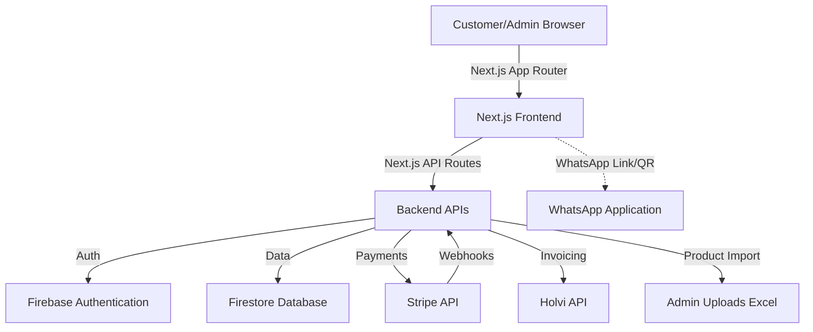

# Eqilo.fi Ecommerce Architecture Plan

## Background & Motivation
Eqilo is launching its Finnish branch (eqilo.fi) with a new ecommerce site. The initial product catalog will be imported from `Price List 2026 V3.0.xlsx`. The platform requires a Customer Portal for shoppers and an Admin Panel for operations, integrating modern technologies for a seamless, scalable experience. Note: Context7 documentation retrieval was bypassed due to API key limitations, relying on standard best practices for integration.

## Company Information
- **Company Name:** Eqilo Oy
- **Business ID:** 3530342-3
- **Postal Address:** Hakkapeliitantie 4, 08350 LOHJA
- **Phone:** +358 50 5633097

## Scope & Impact
- **Customer Portal:** Product discovery, cart, and Stripe checkout.
- **Admin Panel:** Product management (importing from Excel), order/inventory management, and customer CRM.
- **Integrations:** Stripe (Payments), Holvi.fi (Invoicing), GCP/Firebase (Database, Auth, Hosting), WhatsApp (Helpdesk).
- **Aesthetics:** Blue and white branding to match the Eqilo logo (`docs/eqilologo.jpeg`).
- **Internationalization (i18n):** Support for Finnish (FI - Default), English (EN), and Swedish (SE).
- **WhatsApp Helpdesk:** Integrated customer support via WhatsApp, configurable from the Admin Panel.

## Proposed Solution

### Architecture Diagram

### Data Model (Firestore)

**1. `users` Collection**
- `id` (String) - Firebase UID
- `email` (String)
- `role` (String) - 'admin' | 'customer'
- `stripe_customer_id` (String)
- `shipping_address` (Object) - { line1, line2, city, postal_code, country }
- `billing_address` (Object) - { line1, line2, city, postal_code, country }
- `phone_number` (String) - Required by couriers

**2. `products` Collection**
- `id` (String)
- `name` (String)
- `description` (String)
- `price` (Number)
- `tax_rate` (Number) - e.g., 25.5 for Finnish general goods
- `sku` (String)
- `excel_ref_id` (String) - Original ID from Price List Excel
- `inventory_count` (Number)
- `is_active` (Boolean) - Allows drafting or hiding products
- `weight` (Number) - Essential for shipping calculation
- `dimensions` (Object) - { length, width, height }
- `image_urls` (Array of Strings)

**3. `orders` Collection**
- `id` (String)
- `user_id` (String)
- `items` (Array of Objects) - { product_id, quantity, price }
- `subtotal` (Number) - Pre-tax amount
- `tax_total` (Number) - Total VAT amount, required for Holvi invoicing
- `total_amount` (Number) - Final amount including tax
- `shipping_address` (Object) - Snapshot at the time of order
- `status` (String) - 'pending' | 'paid' | 'shipped'
- `tracking_number` (String)
- `courier` (String)
- `stripe_payment_intent` (String)
- `holvi_invoice_id` (String)
- `created_at` (Timestamp)

**4. `settings` Collection**
- `id` (String) - Document ID (e.g., 'global')
- `whatsapp_helpdesk_number` (String) - Configurable international phone number for the WhatsApp helpdesk link.

### API Endpoints (Next.js API Routes)
- `POST /api/checkout/session` - Initializes Stripe Checkout session.
- `POST /api/webhooks/stripe` - Handles Stripe payment success, updates order status, and triggers invoice.
- `POST /api/invoices/generate` - Communicates with Holvi.fi API to generate an invoice.
- `POST /api/admin/import-products` - Parses uploaded `Price List 2026 V3.0.xlsx` and updates product catalog.
- `PUT /api/admin/settings` - Updates global site settings (e.g., WhatsApp helpdesk number).

### WhatsApp Helpdesk Integration Flow
- **Storefront Component:** A fixed floating chat bubble in the bottom right corner of the storefront.
- **Design:** Stylized with the Eqilo primary blue. Includes a white WhatsApp icon, an "Always Online" green dot indicator, and clear contrast. When clicked or hovered (on desktop), it presents a `wa.me/<helpdesk_number>` link or a dynamically generated QR code (using a library like `qrcode.react`).
- **Interaction:**
  - **Mobile:** Tapping the button directly opens the WhatsApp app with a pre-filled greeting message.
  - **Desktop:** Clicking redirects to WhatsApp Web, or scanning the displayed QR code with a phone opens the app.
- **Admin Configuration:** The Admin Panel includes a "Settings" tab where admins can update the `whatsapp_helpdesk_number`. This setting is stored in the `settings` Firestore collection and fetched globally to populate the `wa.me` links.

### Color Palette & Aesthetic
- **Primary:** Eqilo Blue (e.g., `#0055A4` - to be exacted from logo)
- **Secondary/Background:** White (`#FFFFFF`) and Light Grays for UI depth.
- **WhatsApp UI:** The Helpdesk bubble will utilize the primary Eqilo Blue to maintain brand consistency, alongside standard white text and the recognizable WhatsApp icon.
- Framework: Tailwind CSS for rapid styling matching the constraints.

## Alternatives Considered
- **Firebase Cloud Functions vs Next.js API Routes:** We chose Next.js API routes as they colocate frontend and backend logic in a single monorepo, simplifying deployment and sharing types, compared to isolated Firebase Cloud Functions.

## Implementation Plan
1. **Phase 1: Setup & Data Modeling** - Initialize Next.js project, Firebase config, and Tailwind CSS branding. Setup Firestore schemas (including `settings`).
2. **Phase 2: Admin & Catalog Import** - Build the Excel import logic (using a library like `xlsx`) to populate the `products` collection from `Price List 2026 V3.0.xlsx`. This import process will be executed **just once** to initialize the Firestore database. Create Admin views for product management, uploading, and configuring the WhatsApp Helpdesk number. Include a one-time script/process to scrape product descriptions from `https://fdstiming.com/shop/` and translate them into Finnish (FI) and Swedish (SE) to populate the initial catalog.
3. **Phase 3: Customer Portal** - Develop product listing, detail pages, cart state management, and the global floating WhatsApp Helpdesk component.
4. **Phase 4: Checkout & Invoicing** - Integrate Stripe Checkout. Setup webhook listeners. Integrate Holvi API for automated invoices upon payment confirmation.

## Verification & Testing
- Unit tests for API routes (Stripe session creation, Holvi invoice generation mock).
- E2E tests for the checkout flow (Customer -> Cart -> Stripe Test Mode -> Order Success).
- Manual verification of product import from the Excel price list.
- Verification of the WhatsApp link on mobile and QR code scannability on desktop.

## Migration & Rollback
- Since this is a greenfield project, initial migration involves one-time importing from `Price List 2026 V3.0.xlsx`.
- Rollback strategies involve utilizing Firestore point-in-time recovery and Vercel/Cloud Run immediate revert to previous deployments in case of critical bugs.